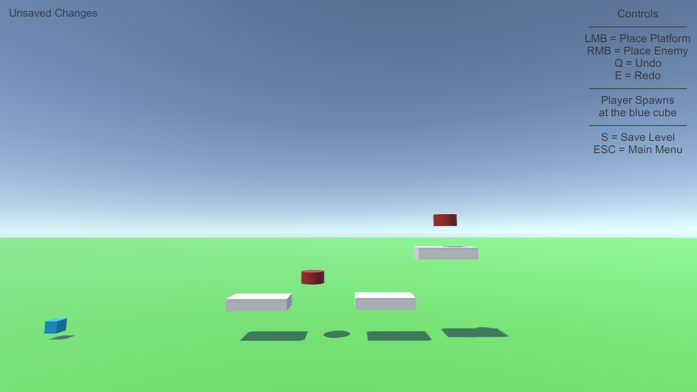
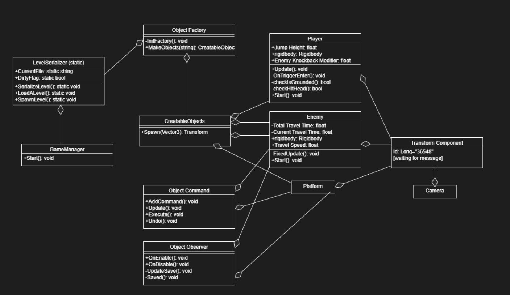

# INFR 3310U - Game Engine Design And Implementation Assingment 3

### Optimized Design Pattern - By Ame Gilham (100741352) 

### Game Description (same as A2)

A simple platformer where the player can defeat enemies from above or below and jump around on platforms. 
The enemies travel back and forth in a line, the player wins by defeating all of the enemies. 
From the main men there is a level editor the player can use to make levels, if no levels are found in the
files it will generate an empty level by default.

### Screenshots (same as A2)

### Demo Video

Youtube link: 

### Developement Team
Ame Gilham - 100741352 - Developer/Programmer

### UML Diagram

### Third-Party acknowledgement

No Third-Party art or sound assets were used

Some code was reused from in class tutorial content
There are no new references excluding things leanred in the tutorials used for this assignment

The following references have been inherented from A2
the following videos were referenced 
while coding some of the features:

Popup: [https://youtu.be/Bm62aXuVX4I](https://youtu.be/Bm62aXuVX4I "Youtube") 
Factory: [https://youtu.be/FGVkio4bnPQ](https://youtu.be/FGVkio4bnPQ "Youtube")
Observer: [https://youtu.be/UWMmib1RYFE](https://youtu.be/UWMmib1RYFE "Youtube")
